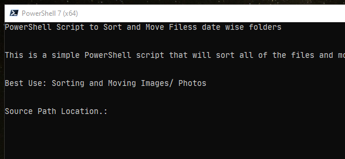
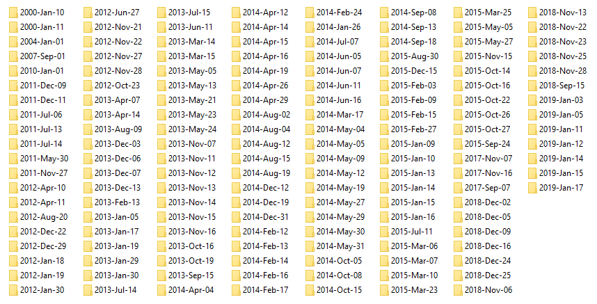

# PowerShell Script to Sort and Move files date wise folders

```text
Platform: Windows Operating System

Type: PowerShell Script (.ps1)

Best Use: Sorting and Moving Images/ Photos
```

**Download PowerShell Script File**

[https://raw.githubusercontent.com/SHSharkar/PowerShell-Script-to-Sort-and-Move-files/main/Sort-and-Move-Files.ps1](https://raw.githubusercontent.com/SHSharkar/PowerShell-Script-to-Sort-and-Move-files/main/Sort-and-Move-Files.ps1)

**Synopsis:** This script was used for sorting and moving personal files, especially the images, to specific date taken folders. Later I thought to share the script with others, which might help others move their files date wise. No special requirements are needed. Only run the PowerShell script file, provide Source Path and the Output / Destination Path or the folder locations, and it will move all of the files to the target directory with date wise folders.

You can also choose the Source and Destination path to the same location. The script will only provide a warning for the same path location. But it will work fine.

#### Available Features

* Move captured images to date taken folders
* Scan inside subfolders
* Move all of the subfolder images to the root folder and sort them into date wise folder
* Delete empty folders after moving
* Option to choose Source Folder and Destination/ Target folder as same




